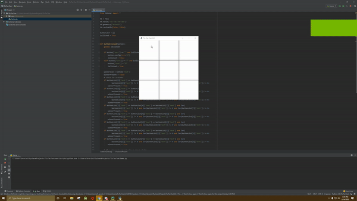

# Tic-Tac-Toe
A simple python GUI of Tic-Tac-Toe

# How It Works
1. Click a square to mark an X or O on it. After you click on a square it is the next person's turn to select a square. 
2. The first person to fill 3 spaces in a row that are horizontal, vertical or diagonal wins!

# About This Project
I'm taking 2 computer science courses that require me to use Python, and this project is just extra Python practice. This project is not related to any of my course-work, other than the fact that it utilizes Python. 
